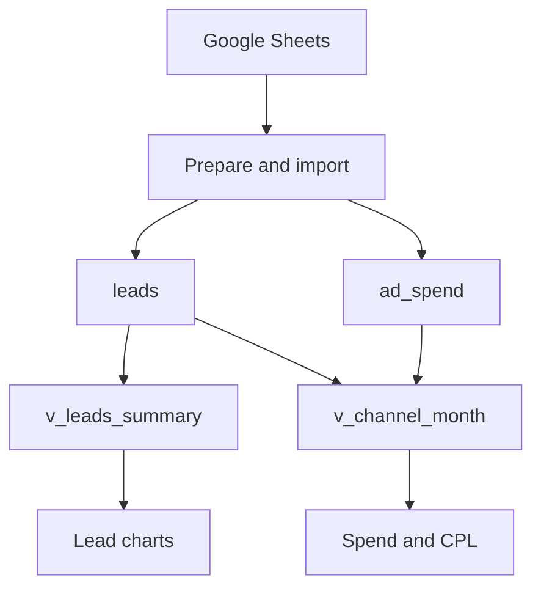

# NexaHub Marketing Performance Dashboard

A marketing BI project built with Google Sheets, Google BigQuery, SQL, and Looker Studio. It connects lead acquisition data with monthly advertising spend to compare channel efficiency and explore lead volume, service demand, and current pipeline status.

## Live Dashboard


[View the interactive NexaHub V2 dashboard](https://datastudio.google.com/reporting/75eefa77-a75c-403f-9579-2e3bc702f48b)

The report supports acquisition-channel filtering and complete-month date selections. The reviewed dataset covers **March–May 2026**, with **30 leads**, **14 paid-channel leads**, and **6 monthly advertising-spend records**.

## Business Questions

- How does lead volume change each month?
- Which acquisition channels generate the most leads?
- What does each paid channel spend per lead?
- Which services attract the most interest?
- How are leads distributed across their current pipeline statuses?

## Tech Stack

| Tool | Role |
|---|---|
| Google Sheets | Source register, upstream preparation, dropdown validation, and sanity checks |
| Google BigQuery | Storage, SQL transformations, and reusable analytical views |
| GoogleSQL | Aggregation, window calculations, date normalization, joins, and metric definitions |
| Looker Studio | Interactive scorecards, charts, filters, and monthly CPL reporting |

## Data Engineering Workflow

The project combines preparation before loading with SQL transformations after loading. The current workflow uses manual imports into BigQuery.

Upstream preparation in Google Sheets included derived week and month fields, acquisition-channel dropdown validation, and pivot-based sanity checks. BigQuery then provides the analytical layer.

### Data Sources

| BigQuery table | Grain | Main fields |
|---|---|---|
| `marketing.leads` | One row per recorded lead | `date`, `channel_source`, `service_interest`, `lead_status`, `country` |
| `marketing.ad_spend` | One row per month and paid channel in the source dataset | `month`, `channel`, `spend_usd` |

Paid-channel scope is explicitly defined as **Google Ads and LinkedIn**.

### Analytical Views

| View | Grain | Dashboard use |
|---|---|---|
| `marketing.v_leads_summary` | One row per source lead | Total Leads, Leads per Month, Service Interest, Lead Status, and Channel breakdowns |
| `marketing.v_channel_month` | One row per month and channel | Ad Spend, Paid CPL, and Monthly CPL table |

The monthly view aggregates each input before joining on `month_date` and `channel_source`. A `FULL OUTER JOIN` preserves unmatched lead and spend records, while missing spend remains `NULL`. The paid-spend integration happens in BigQuery; the V2 CPL charts consume the joined view directly.

## Data Pipeline


Google Sheets contains the lead register and ad-spend inputs. After preparation, both are manually imported into BigQuery's `marketing` dataset. SQL views supply the lead charts and paid-acquisition metrics in Looker Studio.

## Key Metrics

| Metric | Definition |
|---|---|
| Total Leads | Count of source lead records in the selected channels and months |
| Paid Leads | Leads attributed to Google Ads or LinkedIn in the selected months |
| Ad Spend | Sum of recorded advertising spend in USD for the selected channels and months |
| Paid CPL | Total paid-channel spend divided by total paid-channel leads for the same selection |
| Current Closed-Won Share | Leads currently marked `Closed Won` divided by all leads in the selected population |

### Paid CPL and Blended CPL

For the full dataset:

| Metric | Calculation | Result |
|---|---|---:|
| Paid CPL, used in V2 | $7,900 / 14 paid-channel leads | **$564.29** |
| Blended ad spend per all leads | $7,900 / 30 leads across all channels | **$263.33** |

These measures use different denominators. The earlier $263.33 figure distributes ad spend across all leads, including channels without recorded ad spend. It is not the paid-channel CPL shown in V2.

For paid-channel charts, filter `is_paid_channel = TRUE` and calculate:

```text
SUM(spend_usd) / SUM(total_leads)
```

Calculate CPL from summed components rather than averaging monthly CPL values. This dashboard formula assumes complete spend coverage for the selected paid channels and months; review `cpl_status` before reporting newly imported data.

## Dashboard Configuration

| Component | Data source | Metric |
|---|---|---|
| Total Leads and four lead charts | `v_leads_summary` | Record Count |
| Ad Spend | `v_channel_month` | `SUM(spend_usd)` |
| Paid CPL | `v_channel_month` | `SUM(spend_usd) / SUM(total_leads)`, filtered to paid channels |
| Monthly CPL table | `v_channel_month` | Leads, spend, and Paid CPL by month and channel |

For these components, use a complete Date field, `month_date`, as the date-range dimension and set the default date range to **Auto**. Sort monthly reporting chronologically.

Because the reporting date is the first day of each month and spend is monthly, select **whole calendar months**. Arbitrary partial-month selections are not supported accurately by this model.

## Validation Results

The following source reconciliation targets and dashboard checks were recorded during development. They are manual checks, not an automated test suite.

| Selection | Total Leads | Paid Leads | Ad Spend | Paid CPL |
|---|---:|---:|---:|---:|
| March–May, all channels | 30 | 14 | $7,900 | $564.29 |
| March–May, Google Ads | 11 | 11 | $5,500 | $500.00 |
| March–May, LinkedIn | 3 | 3 | $2,400 | $800.00 |
| March, all channels | 10 | 5 | $2,300 | $460.00 |
| March, Google Ads | 4 | 4 | $1,500 | $375.00 |

The March date-filter recheck also confirmed a single monthly bar of 10 and service, status, and channel breakdowns representing the same 10 leads.

## Findings and Business Implications

| Finding from March–May | Implication | Suggested follow-up |
|---|---|---|
| Google Ads generated 11 leads at $500 CPL; LinkedIn generated 3 at $800 CPL | Google Ads had 37.5% lower CPL in this sample | Compare lead quality and subsequent outcomes before changing budgets |
| Google Ads monthly CPL rose from $375 in March to $550 in April and $600 in May | Acquisition cost per lead increased over the observed period | Review campaign targeting, traffic, and landing-page performance; the available data does not establish the cause |
| EOR accounted for 15 of 30 leads (50%) | EOR was the most frequently requested service | Investigate EOR messaging and service capacity using a larger sample |

These are descriptive findings from a small dataset, not evidence of measured business impact or causal effects.

## Running the SQL

1. Create a BigQuery dataset and load the lead and ad-spend inputs into `leads` and `ad_spend`.
2. Replace `nexahub-analytics.marketing` in the scripts if using another project or dataset.
3. Run [06_create_leads_summary_view.sql](sql/06_create_leads_summary_view.sql) and [07_create_channel_month_view.sql](sql/07_create_channel_month_view.sql).
4. Connect each view to the appropriate Looker Studio components and configure the filters above.
5. Reconcile lead counts, spend, and CPL against the source data before sharing the report.

See [SQL Analysis](sql/README.md) for query descriptions, input types, edge cases, and validation SQL. Queries 01–04 are standalone exploratory analyses. Query 05 is retained as an earlier Google Ads example; query 07 supplies the current monthly CPL layer.

## Repository Contents

| Path | Contents |
|---|---|
| [sql/](sql/) | Seven SQL scripts and the SQL analysis guide |
| [data/leads_sample.csv](data/leads_sample.csv) | Two illustrative lead records showing the input structure |
| [LICENSE](LICENSE) | MIT license |

The committed CSV is not the complete dataset behind the dashboard. The full 30-lead register and ad-spend input are not included in the repository, so the sample alone cannot reproduce the reported totals.

## Scope and Limitations

- Lead counts assume one valid record per lead. The source has no persistent lead ID, and the current views do not deduplicate records.
- Status is a current snapshot. A lead marked `Closed Won` is not evidence that it closed during its acquisition month, and stage-to-stage conversion cannot be reconstructed.
- Monthly spend does not support reliable daily CPL or allocation by country, service, or campaign.
- Missing spend and zero leads produce unavailable CPL. Missing spend must not be interpreted as zero cost.
- The project does not currently implement scheduled ingestion, incremental loading, or automated quality tests.

